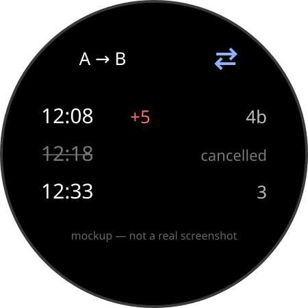

# vertrek

A Cloudflare Worker + Wear OS tile that shows the next few departures for
**one fixed commute route** on the Dutch railway (NS) network, straight on
your watch face.


*(placeholder mockup — not a real screenshot yet)*

You deploy your own Worker, with your own NS API key and your own two
stations. There is no shared instance, no server run by the author, and
no account system — this is a template you run for yourself.

## Non-goals

This project is deliberately small in scope. It does **not** have, and
never will (pull requests adding these will be declined):

- a station picker — the two stations are set once, in your Worker config
- GPS / location awareness
- bus, tram, or metro departures — NS trains only
- an iOS app
- support for more than one commute route per deployment

If you want any of the above, this repo is a fine starting point to fork
and extend, but that's a different project from what's here.

## Repo layout

```
worker/   Cloudflare Worker (TypeScript) — proxies the NS API
wear/     Wear OS app (Kotlin)           — tile + companion app
```

## Setup

### 1. Get your own NS API key

1. Sign up at [apiportal.ns.nl](https://apiportal.ns.nl).
2. Subscribe to the **NsApp** product.
3. Copy your `Ocp-Apim-Subscription-Key` — you'll use it as `NS_API_KEY`
   below. NS API usage is subject to their terms (see the notice at the
   bottom of this README) — this key is yours, tied to your account, and
   should never be committed or shared.

### 2. Deploy the Worker with your key and stations

```bash
cd worker
npm install
```

`worker/wrangler.jsonc` is checked into git with placeholder example
stations (Amsterdam Centraal / Utrecht Centraal) — it's the public
template, not your personal config. Keep your real stations out of it so
`git pull` never conflicts with your own edits:

```bash
cp wrangler.jsonc wrangler.local.jsonc   # gitignored — verify with:
git check-ignore -v wrangler.local.jsonc
```

Edit `STATION_A` / `STATION_B` in `wrangler.local.jsonc` to your own two
NS station codes (look them up at
[ns.nl/stationsinformatie](https://www.ns.nl/stationsinformatie)), then
always pass `-c wrangler.local.jsonc` so Wrangler uses it instead of the
tracked file:

```bash
npx wrangler dev -c wrangler.local.jsonc      # local dev, your stations
npx wrangler deploy -c wrangler.local.jsonc   # deploy, your stations
```

(`.dev.vars` isn't used here — Wrangler only reads it for `wrangler dev`,
not for `wrangler deploy`, so it can't hold `STATION_A`/`STATION_B` for a
real deployment. A full `-c` config file is the mechanism that works for
both.)

If you'd rather not keep a second config file at all, skip
`wrangler.local.jsonc` and just edit `wrangler.jsonc` directly — nothing
about your two station codes needs to be secret, this is purely to keep
`git pull` clean if you fork this repo and want to track upstream changes.

Set your API key as a secret (never in a file that gets committed):

```bash
npx wrangler login   # first time only
npx wrangler secret put NS_API_KEY
# paste your Ocp-Apim-Subscription-Key value when prompted
```

**Also set `VERTREK_KEY` — this is not optional.** The Worker's `/next`
endpoint requires a matching `X-Vertrek-Key` header on every request; if
`VERTREK_KEY` isn't set, the Worker refuses *every* request with `500`
(it fails closed, not open — it will not silently serve trips to anyone
who finds your `workers.dev` URL). Make up your own secret value — it
doesn't come from NS, it's just a shared secret between your Worker and
your watch app:

```bash
npx wrangler secret put VERTREK_KEY
# paste a random value you generate yourself, e.g.:
openssl rand -hex 32
```

You'll enter this same value into the watch app's `local.properties` as
`VERTREK_API_KEY` (see Part 2 setup) so it can send it back as
`X-Vertrek-Key`. If you skip this step, expect every request to
`/next` to come back `500 SERVER_MISCONFIGURED` — that's the Worker
telling you the secret isn't set, not a bug.

Deploy:

```bash
npm run deploy                              # uses wrangler.jsonc (examples), or
npx wrangler deploy -c wrangler.local.jsonc # uses your real stations
```

This gives you `https://<worker-name>.<your-subdomain>.workers.dev` —
your own private endpoint. Note it down; the watch app needs it.

For local development, create `worker/.dev.vars` (gitignored, never
committed):

```
NS_API_KEY=your-local-dev-key
VERTREK_KEY=your-local-dev-vertrek-key
```

Run it locally with `npm run dev`, then:

```bash
curl -H "X-Vertrek-Key: your-local-dev-vertrek-key" "http://localhost:8787/next?dir=ab"
```

### 3. Build and sideload the watch app

The watch app is a single Wear OS module (`wear/`) — a tile
(`androidx.wear.protolayout`) plus a Compose companion screen. It talks
only to your own Worker from step 2, using the `X-Vertrek-Key` header.

Create `wear/local.properties` (gitignored, never committed):

```properties
sdk.dir=/path/to/your/Android/sdk
NS_WORKER_BASE_URL=https://your-worker-name.your-subdomain.workers.dev
VERTREK_API_KEY=the-same-value-you-set-as-the-Worker-secret-VERTREK_KEY
STATION_A=ALMO
STATION_B=ASD
```

All four are read into `BuildConfig` at build time — never hardcoded in
source:

- `NS_WORKER_BASE_URL` / `VERTREK_API_KEY` — where the app sends requests
  and the key it authenticates with. Must match your deployed Worker's
  URL and its `VERTREK_KEY` secret exactly, or every request comes back
  `401`.
- `STATION_A` / `STATION_B` — **display-only**. The Worker resolves
  stations server-side; the app never sends these anywhere. They only
  drive the header label (e.g. "ALMO → ASD"). Default to "A"/"B" if
  omitted, so a fresh checkout still builds.

Build a debug APK:

```bash
cd wear
./gradlew assembleDebug
# output: app/build/outputs/apk/debug/app-debug.apk
```

#### Install on a Galaxy Watch over wireless debugging

On the watch: **Settings → About watch → tap "Software version" 7
times** to unlock Developer options, then **Settings → Developer
options** → enable **ADB debugging** and **Wireless debugging**. Open
**Wireless debugging → Pair new device** — it shows a 6-digit code and a
`pairing IP:port`, and separately the screen shows a `connection IP:port`
for after pairing.

```bash
# 1. Pair once (IP:port and code from "Pair new device" on the watch)
adb pair <PAIRING_IP>:<PAIRING_PORT>
# enter the 6-digit code when prompted

# 2. Connect (IP:port shown on the main Wireless debugging screen —
#    usually a different port than the pairing one)
adb connect <WATCH_IP>:<CONNECT_PORT>

# 3. Confirm it's there
adb devices

# 4. Install (-r replaces an existing install, keeping app data)
adb install -r app/build/outputs/apk/debug/app-debug.apk
# or, for a signed release build:
adb install -r app/build/outputs/apk/release/app-release.apk
```

Pairing is one-time per watch/computer pair; after that, `adb connect`
alone is enough (the watch's IP can change between networks, so re-check
the Wireless debugging screen if `connect` fails).

---

## Worker: API reference

```
GET /next?dir=ab|ba
X-Vertrek-Key: <your VERTREK_KEY secret>
```

Every request must include a valid `X-Vertrek-Key` header — see Setup
step 2. Missing, empty, or wrong key: `401`. `VERTREK_KEY` not configured
on the Worker at all: `500` (fails closed, never open). Neither case
calls the NS API.

`dir=ab` is `STATION_A` → `STATION_B`, `dir=ba` is the reverse. Returns up
to `MAX_TRIPS` upcoming trips (a `wrangler.jsonc` var, default 6), cached
for 30 seconds per `dir`:

```json
{
  "dir": "ab",
  "trips": [
    {
      "departureTime": "2026-11-02T12:08:00+0100",
      "delayMinutes": 5,
      "track": "4b",
      "durationMinutes": 33,
      "transfers": 0,
      "cancelled": false
    }
  ]
}
```

All error responses are machine-readable JSON:

```json
{ "error": { "code": "UNAUTHORIZED", "message": "..." } }         // 401
{ "error": { "code": "SERVER_MISCONFIGURED", "message": "..." } } // 500
{ "error": { "code": "NS_API_UNAVAILABLE", "message": "..." } }   // 502
```

## Development

```bash
cd worker
npm test          # vitest, against a recorded fixture — no network calls
npm run typecheck
```

CI (`.github/workflows/ci.yml`) runs `npm install`, `npm run typecheck`,
and `npm test` on every push/PR. It does **not** run `verify:live` — that
needs a real `NS_API_KEY` and is meant to be run manually.

### A note on the NS OpenAPI spec

`apiportal.ns.nl` renders its API docs client-side and requires a
signed-in session to reach the underlying management API (confirmed by
reading the portal's `config.json` and calling its management API
directly — anonymous requests get a `401`). Without portal credentials,
the exact `/v3/trips` request/response shape used in
`worker/src/ns-types.ts` was cross-checked against two independent
real-world clients built against the live v3 API, which agree exactly on
field names — but it hasn't been confirmed against NS's own spec.

If you have your own NS API key, you can check the assumed schema against
the live API yourself:

```bash
NS_API_KEY=xxxx FROM_STATION=ASD TO_STATION=UT npm run verify:live
```

This script only ever prints field **names** it found missing or new —
never your API key, never request headers, never the actual response
body (which is live train data for whatever route you query).

## License

[MIT](LICENSE) © Stepan Suvorov.

MIT covers this code only; use of the NS API is governed by NS terms and
requires your own key.

---

Not affiliated with or endorsed by Nederlandse Spoorwegen. NS API usage is
subject to their terms; the API is intended for private, non-commercial
use.
